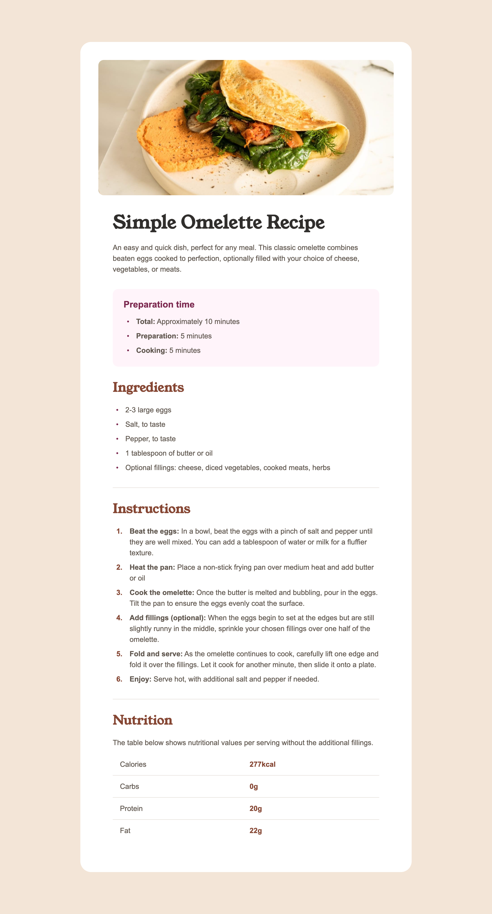

# Frontend Mentor - Recipe page solution

This is a solution to the [Recipe page challenge on Frontend Mentor](https://www.frontendmentor.io/challenges/recipe-page-KiTsR8QQKm). Frontend Mentor challenges help you improve your coding skills by building realistic projects.

## Table of contents

- [Frontend Mentor - Recipe page solution](#frontend-mentor---recipe-page-solution)
  - [Table of contents](#table-of-contents)
  - [Overview](#overview)
    - [Screenshot](#screenshot)
    - [Links](#links)
  - [My process](#my-process)
    - [Built with](#built-with)
    - [Scripts](#scripts)
    - [What I learned](#what-i-learned)
    - [Continued development](#continued-development)
    - [Useful resources](#useful-resources)
  - [Author](#author)

## Overview

### Screenshot



### Links

- Solution URL: [Add solution URL here](https://your-solution-url.com)
- Live Site URL: [Add live site URL here](https://your-live-site-url.com)

## My process

### Built with

- Svelte kit, powered by [`create-svelte`](https://github.com/sveltejs/kit/tree/main/packages/create-svelte).
- Mobile-first workflow

### Scripts

Once you've created a project and installed dependencies with `npm install` (or `pnpm install` or `yarn`), start a development server:

```bash
npm run dev

# or start the server and open the app in a new browser tab
npm run dev -- --open
```

To create a production version of your app:

```bash
npm run build
```

You can preview the production build with `npm run preview`.

> To deploy your app, you may need to install an [adapter](https://kit.svelte.dev/docs/adapters) for your target environment.

### What I learned

The most memorable part while building this project propably the list styling, read more at [Creative list styling](https://web.dev/articles/creative-list-styling).

### Continued development

In the future, I plan to focus on the following areas for further development:

- Improving the responsiveness of the website for different screen sizes.
- Enhancing the user experience by adding interactive features such as animations and transitions.
- Implementing a search functionality to allow users to easily find specific recipes.
- Adding a backend server to store and retrieve recipe data.
- Optimizing the performance of the website by minimizing file sizes and improving loading times.

These are just a few ideas for continued development, and I'm excited to explore more possibilities to enhance the recipe page solution.

### Useful resources

- [Creative list styling](https://web.dev/articles/creative-list-styling) - This helped me for styling those list.

## Author

- Website - [Nhan Nguyen](https://trinhan.xyz)
- Frontend Mentor - [@edwardnguyen225](https://www.frontendmentor.io/profile/edwardnguyen225)
